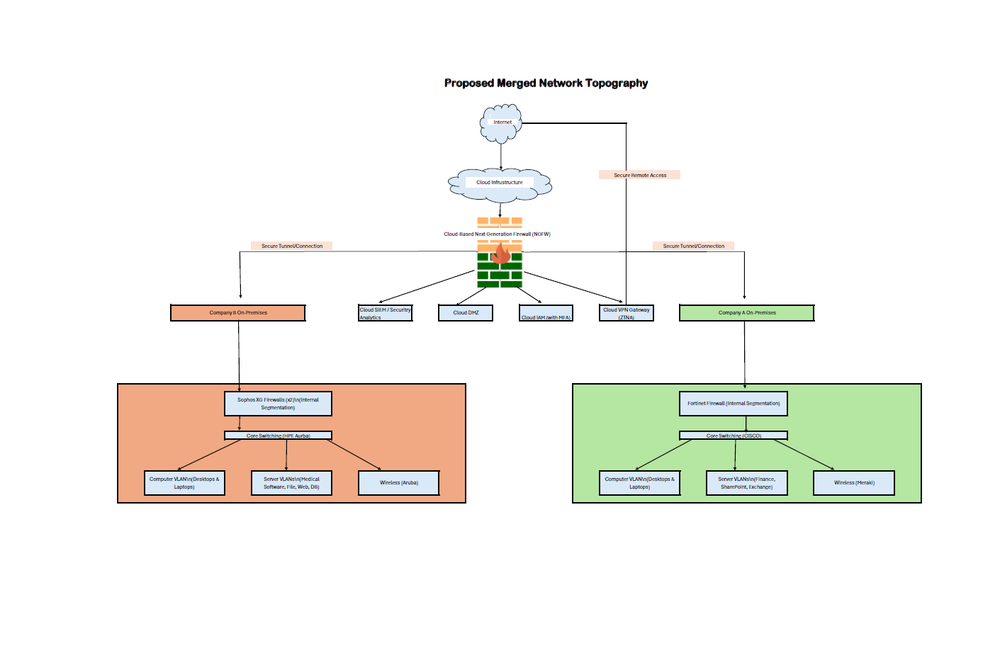

# Enterprise Network Security Transformation & Merger

## Executive Summary
This project outlines a high-stakes security overhaul and infrastructure integration following the merger of two multi-site organizations: a **Financial Services firm** and a **Medical Software provider**. 

As the Lead Security Architect, I was tasked with unifying two disparate, high-risk environments into a single, hardened **Hybrid-Cloud infrastructure** within a strict **$50,000 first-year budgetary cap**. The transformation moved the organizations away from a fragmented "perimeter-only" defense toward a modern **Zero-Trust architecture**. By strategically repurposing legacy assets and migrating critical services to an OpEx cloud model, I successfully remediated catastrophic RCE vulnerabilities and established a foundation compliant with **PCI DSS** and **HIPAA** standards.

---

## 1. The Problem Statement: A "Toxic" Infrastructure Merger
The primary challenge was the "toxic asset" risk inherent in the merger. Both organizations brought significant technical debt and security gaps that, if integrated without remediation, would have compromised the entire unified network.

### **The Critical Gaps:**
* **Conflicting Risk Profiles:** Unifying a finance network (heavy external transaction traffic) with a medical provider (sensitive ePHI data handling).
* **Technical Debt:** Reliance on end-of-life (EoL) systems including Windows 7 workstations and Windows Server 2012 instances, which were no longer receiving security patches.
* **Open Attack Surface:** Pre-merger audits revealed high-risk open ports (FTP/RDP) and a complete lack of Multi-Factor Authentication (MFA) across legacy VPNs.
* **Severe Vulnerabilities:** Active exposure to Remote Code Execution (RCE) flaws in core service frameworks.

---

## 2. Pre-Integration Risk Audit & Discovery
Before proposing a solution, a comprehensive audit was conducted to identify "Red Line" risks that required immediate mitigation.

### **Vulnerability Assessment Results**
| Vulnerability Type | CVE Reference | Impact |
| :--- | :--- | :--- |
| **dRuby RCE** | CVE-2021-29425 | Allowed unauthorized remote execution on internal servers. |
| **Java RMI RCE** | CVE-2017-3241 | Enabled attackers to bypass security managers and execute arbitrary code. |
| **Ghostcat** | CVE-2020-1938 | Exposed Apache Tomcat AJP connectors to credential theft and RCE. |
| **Exposed RDP** | Port 3389 | Frequent brute-force attempts detected on Company A’s perimeter. |

### **Project Constraints**
* **Budget:** $50,000 (inclusive of licensing, new hardware, and migration costs).
* **Compliance:** Architecture must satisfy both PCI DSS (Cardholder Data) and HIPAA (Patient Privacy) simultaneously.

---

## Project Overview
This project represents a comprehensive security architecture designed for the merger of a financial services firm and a medical software provider. The solution establishes a hardened **Hybrid-Cloud environment** while strictly adhering to a **$50,000 first-year budgetary cap**.

---

## Technical Specifications: OSI & TCP/IP Layer Mapping
To ensure the security architecture is technically sound, each infrastructure component has been mapped to its respective layer in the OSI and TCP/IP models.

| Component Type | OSI Layer(s) | TCP/IP Layer(s) |
| :--- | :--- | :--- |
| **Cloud-Based Next-Generation Firewall (NGFW)** | Layers 3 (Network) - 7 (Application) | Layers 3 (Internet) - 4 (Application) |
| **On-Premises Firewalls (Repurposed)** | Layers 3 (Network) - 7 (Application) | Layers 3 (Internet) - 4 (Application) |
| **VLANs (Logical Segmentation)** | Layer 2 (Data Link) | Layer 2 (Link) |
| **Micro-segmentation (Cloud NSGs/Security Groups)** | Layers 3 (Network) - 4 (Transport) | Layers 3 (Internet) - 4 (Transport) |
| **Centralized IAM System** | Layer 7 (Application) | Layer 4 (Application) |
| **Endpoint Detection and Response (EDR)** | Layers 3 (Network) - 7 (Application) | Layers 3 (Internet) - 4 (Application) |
| **Core Switching (Cisco/HPE/Aruba)** | Layer 2 (Data Link) | Layer 2 (Link) |
| **Wireless Access Points (Meraki/Aruba)** | Layers 1 (Physical) - 3 (Network) | Layers 1 (Link) - 3 (Internet) |
| **Servers** | Layers 1 (Physical) - 7 (Application) | Layers 1 (Link) - 4 (Application) |

---

## Security Strategy & Risk Mitigation
The architecture adopts a **Zero-Trust** security model and successfully remediated critical pre-merger vulnerabilities:

* **Remote Code Execution (RCE):** Mitigated critical flaws including dRuby (CVE-2021-29425), Java RMI (CVE-2017-3241), and Ghostcat (CVE-2020-1938).
* **Legacy Systems:** Decommissioned end-of-life Windows 7 and Server 2012 systems to close unpatched security gaps.
* **Perimeter Hardening:** Closed high-risk open ports (FTP/RDP) and enforced mandatory MFA via Duo.
* **Compliance Frameworks:** Aligned controls with **PCI DSS** (Cardholder Data) and **HIPAA** (ePHI) requirements via strict VLAN isolation and encryption.

---

## Financial Strategy: $50,000 Budget Cap
A key requirement was managing integration within a strict financial limit. The strategy included:

| Category | Strategy | Rationale & Budgetary Impact |
| :--- | :--- | :--- |
| **Infrastructure** | **Transition to OpEx** | Shifted to cloud subscriptions to avoid high upfront hardware capital costs. |
| **Internal Defense**| **Hardware Repurposing** | Reused existing Fortinet/Sophos hardware for internal zones to save costs. |
| **Endpoint Protection** | **License Expansion** | Expanded existing Sophos Intercept X deployments to reduce new procurement needs. |

---

## Technical Competencies
`Hybrid Cloud Architecture` `Zero-Trust Security` `Network Segmentation` `Vulnerability Management` `PCI DSS & HIPAA Compliance` `EDR/SIEM Implementation`
